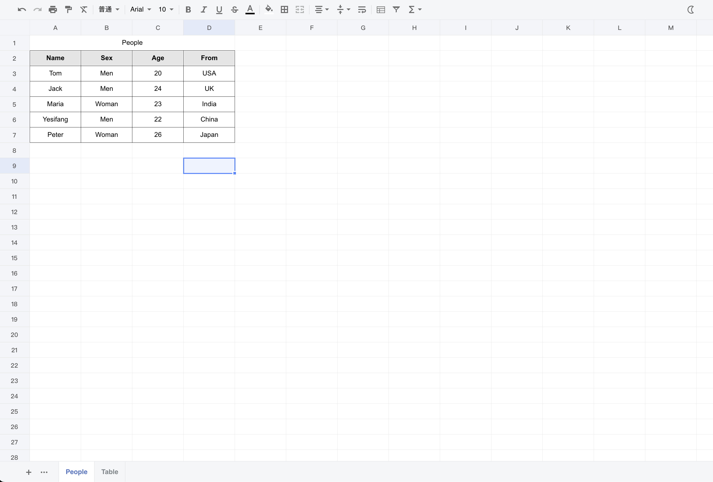
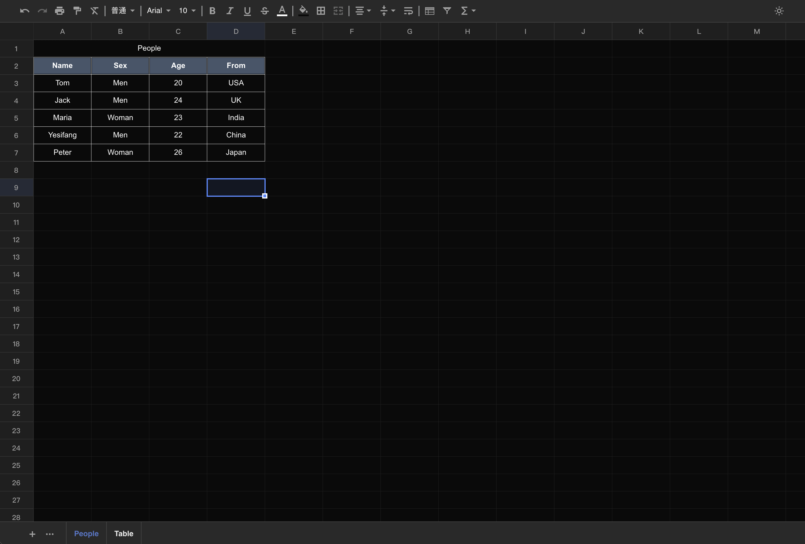

# excel-viewer


[![blog](https://img.shields.io/badge/blog-yesifang.com-orange?logo=data:image/png;base64,iVBORw0KGgoAAAANSUhEUgAAACAAAAAgCAMAAABEpIrGAAAABGdBTUEAALGPC/xhBQAAACBjSFJNAAB6JgAAgIQAAPoAAACA6AAAdTAAAOpgAAA6mAAAF3CculE8AAABjFBMVEUAAAAIAQUiBhQVBA05CyK0I2z4MJTgKoV8GEoKAgZyFkT8MZfTKX4dBRFWEDP9MZfMJ3kGAQQHAQTlK4htFUEAHRMATDAAbUQAf1EAh1QAgFAAbUUATDAAHhNMDy7KJngAeUsAKBp9GEr4MJMDAQIAmWEAWzkABAOGGlD9MZYAcUgABQNoFD7mLIoAZUCdHl4ANiKiH2EpCBgAh1UAAgERAwrVKH9nFD0ALBwSAwuqIWXmK4pTEDIAWTgrCBp2F0eVHVmKG1NWETMAdEgAgVAAAQIAJTcATXIAZJQAbqUAap0AVoEAfE4AAQEAN1EAgMAAaEIACQ4Aap4ARiwACQ0AebMAmV8AEwwAAAAAZ5oAZT8AMkkAkFoAEQsAebMAl14AGCQAkl0ALx4AOlYAeEsAGRAATHAAbkUAll0All4AbkYAMB4ATXMABwQAIxYANiIAPicANyIAJBYAQF4AIjIAis0AAgMAhsYAZJYARWYAk9oAHy4ABQcAfbkAO1gAis3/MZgAmmEAld3///8EabibAAAAgHRSTlMACCIVObX54XwKcv3UHVb+zQYH5m0xfrTU4NW1fzJMy8hDffkD/pcHh/69CGjnqJ5ZoynfBBHWZ0kSqudTlCt2lotWwNUCQIOrvrWVzwFe3a4QtnQPz/0gAbKnVe4c0Psp9E9jximBtvj4t0+FCzpaZlo7bTruA+Wtdfs1CNdm7ZpKyEIAAAABYktHRIP8tM/SAAAAB3RJTUUH5QoVBh0NInrzjgAAATtJREFUOMt902VbwzAUBeDLcAYMhru7uzPcXYcP1+EyPMkvZ03TNk0TztfzNnL7BECeCFck/JOo6BiEYuPiVX2CG9EkJsn7ZA9iSUmV9d40ZCYdICMzKzsnNy+/wASFVo+KALCR4hIGSjlQVm4BXFFZRUE1B2q8HMC4tk4D9RxoABvAjRpwuS3QJADcrIkW6witImhrD4OOTtZ7ukAEuFtboqeXjqqvH5xgQL/qoG9oeET/FQIYdQxWAGNmMT4xOTU9MyuCOVbPLywSGhEs6f3yCiFysEr7tXWiABubWu/fIiqwTRfYISqwu0fBvgoc0DlCgCjA4ZF+hWMFODllMzizgfML2l5eXfuNGd7YAARv7+4fHoPc9J/swJlnrn+Rgdc3C4SkT+vd7D8+peDr2+h/FK838Ev3D4W//wNiKCWwWalJAwAAACV0RVh0ZGF0ZTpjcmVhdGUAMjAyMS0xMC0yMVQwNjoyOToxMyswMDowMP1Zb/cAAAAldEVYdGRhdGU6bW9kaWZ5ADIwMjEtMTAtMjFUMDY6Mjk6MTMrMDA6MDCMBNdLAAAAAElFTkSuQmCC)](//yesifang.com)

> 这是一个excel文件查看器，支持xls、xlsx、csv格式，你可以用它在指定DOM渲染excel，也可以将它内嵌在iframe中。
>
> This is an excel file viewer that supports xls, xlsx, csv and ods. You can use it to render excel in the specified DOM or embedded it in the iframe.

<div align="center">
  <a href="https://nodei.co/npm/excel-viewer/"></a>
</div>

[中文文档](./docs/zh_cn.md)

## Introduction

This is an excel file viewer developed using [xlsx](https://github.com/SheetJS/sheetjs) and [xspreadsheet](https://github.com/myliang/spreadsheet).

Added light and dark theme mode switching, new support for Chinese, new support for iframe, so that you can use it right out of the box.





## Usage

`new ExcelViewer(el:string|HTMLElement, source:string|Buffer, options)`

+ el：excel view container.
  + `string`：excel view element selector string.
  + `HTMLElement`：html element
+ source：excel source url or data.
  + `string`：excel file source url.
  + `Buffer`：excel file source buffer data.
+ options：more functions.

```js
new ExcelViewer("#excel-view", "http://example.com/test.xls", {
    theme: "dark",
    lang: "zh_cn"
});
```

### options


| option     | type                | description                                    |
| ------------ | --------------------- | ------------------------------------------------ |
| `theme`    | `"light"`、`"dark"` | excel theme mode. default`"light"`             |
| `themeBtn` | `boolean`           | enable theme mode switch button. default`true` |
| `lang`     | `"en"`、`"zh_cn"`   | viewer language. default`"en"`                 |

+ supports language


| lang      | description                    |
| ----------- | -------------------------------- |
| `"en"`    | English                        |
| `"zh_cn"` | 简体中文（Simplified Chinese） |

### iframe

```html
<iframe src="https://unpkg.com/excel-viewer@1.0.0/dist/index.html?file=http://example.com/test.xls"></iframe>
```

+ query params


| params      | description                                                              |
| ------------- | -------------------------------------------------------------------------- |
| `file`      | excel file url.                                                          |
| `theme`?    | excel viewer theme mode. supports:`light`、`dark`                        |
| `themeBtn`? | enable viewer theme switch button. supports:`1 ` (true)、`0 ` (disabled) |
| `lang`?     | viewer language. supports:`en`、`zh_cn`                                  |

### CDN

```html
<link rel="stylesheet" href="https://unpkg.com/excel-viewer@1.0.0/dist/excel/xspreadsheet.css">
<script src="https://unpkg.com/excel-viewer@1.0.0/dist/excel/xspreadsheet.js"></script>
<script src="https://unpkg.com/excel-viewer@1.0.0/dist/excel/xlsx.full.min.js"></script>
<script src="https://unpkg.com/excel-viewer@1.0.0/dist/excel-viewer.js"></script>
<script>
    new ExcelViewer("#excel-view", "http://example.com/test.xls", {
        theme: "dark",
        lang: "zh_cn"
    });
</script>
```

### ESM

```js
import ExcelViewer from "excel-viewer";

new ExcelViewer("#excel-view", "http://example.com/test.xls", {
    theme: "dark",
    lang: "zh_cn"
});
```

## Authorization

If your excel file needs authorization, you can help you through this.

### iframe

```html
<iframe id="excel-viewer"></iframe>

<script>
let iframe = document.getElementById("excel-viewer");
// example with axios
axios({
    url: "http://example.com/test.xls",
    method: "GET",
    headers: { "Authorization": "Your Authorization Token" }, // authorization token
    responseType: "blob"
}).then(blob => {
    let localUrl = URL.createObjectURL(blob) + ".xls"; // add excel file suffix
    iframe.src = "https://unpkg.com/excel-viewer@1.0.0/dist/index.html?file=" + localUrl;
})
</script>
```

### CDN

```html
<div id="excel-view"></div>

<script>
// example with axios
axios({
    url: "http://example.com/test.xls",
    method: "GET",
    headers: { "Authorization": "Your Authorization Token" }, // authorization token
    responseType: "arraybuffer"
}).then(res => {
    new ExcelViewer("#excel-view", res.data);
})
</script>
```

### ESM

```vue
<template>
	<div ref="excel-view"></div>
</template>
<script>
import axios from "axios";
import ExcelViewer from "excel-viewer";

// example with vuejs and axios
export default {
    mounted() {
        let container = this.$refs["excel-view"];
  
        axios({
            url: "http://example.com/test.xls",
            method: "GET",
            headers: { "Authorization": "Your Authorization Token" }, // authorization token
            responseType: "arraybuffer"
        }).then(res => {
            new ExcelViewer(container, res.data);
        })
    }
}
</script>
```

## !!Known Restrictions

If you need to use multiple excel-viewer on one page, the ESM method will not be able to set different theme modes for the previewer and cannot use the theme switching function. You can use the iframe embedded approach to solve this problem perfectly.

```html
<div id="excel-view1"></excel-view>
<div id="excel-view2"></excel-view>
<script>
    // right
    new ExcelViewer("#excel-view1", "http://example.com/test.xlsx", { theme: "dark", themeBtn: false });
    new ExcelViewer("#excel-view2", "http://example.com/test.xlsx", { theme: "dark", themeBtn: false });
    // error
    new ExcelViewer("#excel-view1", "http://example.com/test.xlsx", { theme: "dark", themeBtn: true }); // error，themeBtn should disabled
    new ExcelViewer("#excel-view2", "http://example.com/test.xlsx", { theme: "light", themeBtn: false }); // error, multiple viewer theme mode must be the same
</script>
```